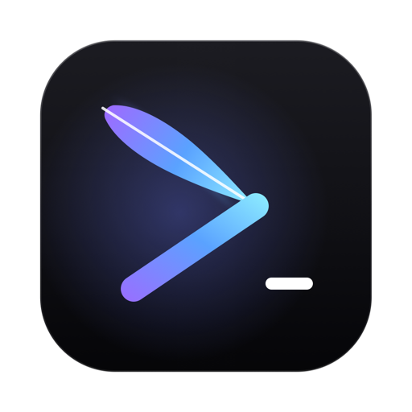
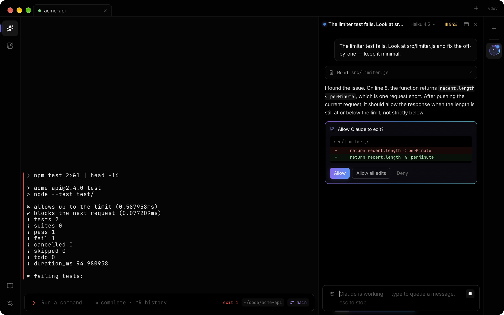
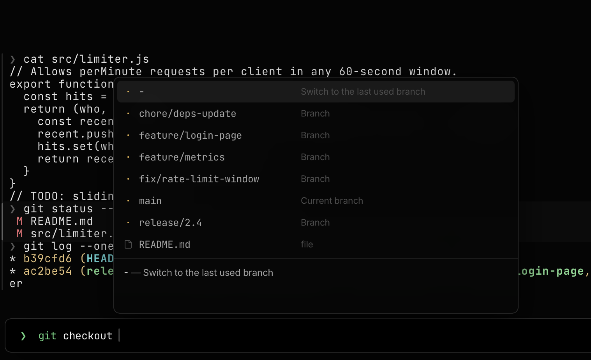
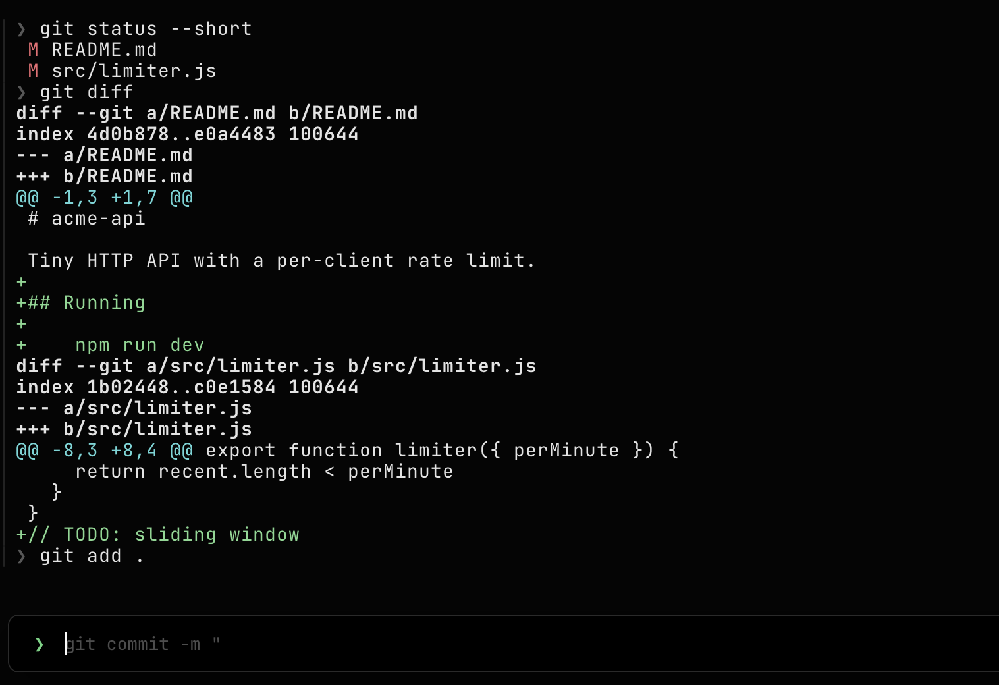
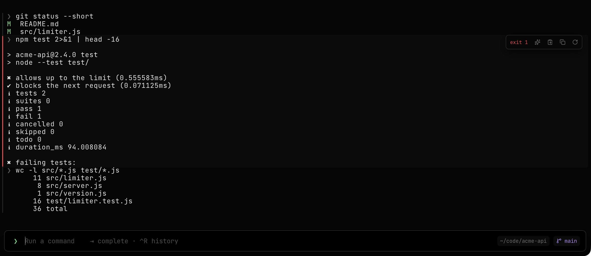
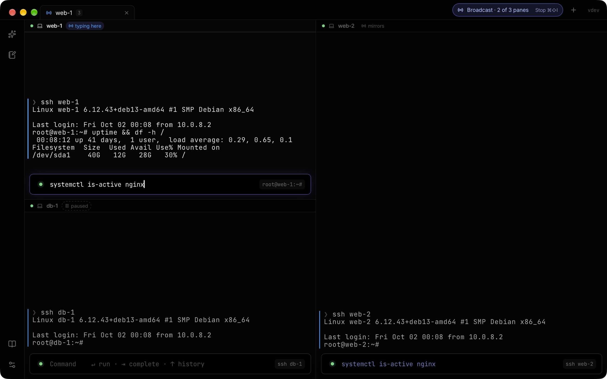
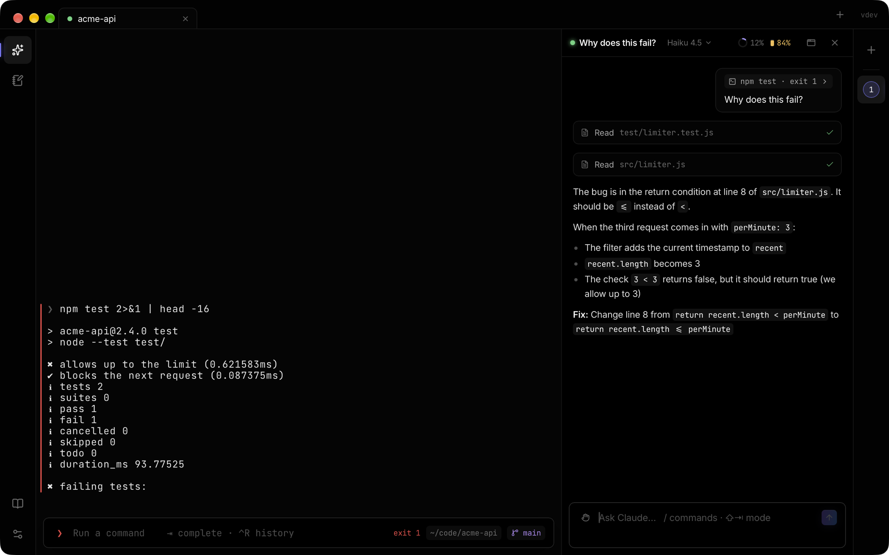
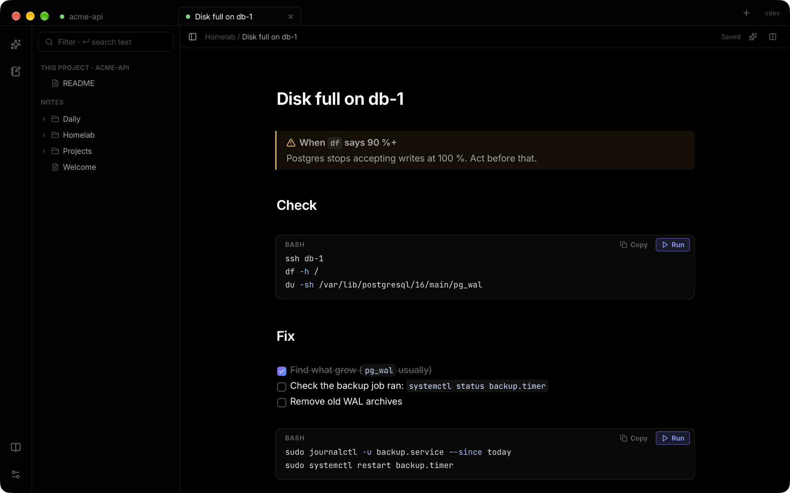

# TernQuill

**A terminal built around its input bar.**

Type commands in a real editor, with suggestions from your history and completion that explains itself.
Output falls into tidy blocks. And when you want help, an AI agent sits right next to your terminal — on your own account.

 

 

## Commands deserve a real editor

The input bar is where you type: multi-line, with syntax highlighting, your history as suggestions, and a check for commands that don't exist before you press Enter.

<table>
<tr>
<td width="50%"></td>
<td width="50%"></td>
</tr>
<tr>
<td><b>Completion that explains itself</b> Subcommands, options, git branches, npm scripts and files — each with a short description. Built-in knowledge of hundreds of tools, live answers from kubectl and helm.</td>
<td><b>It remembers what comes next</b> Your history, ranked by where you are and what you ran just before, offered as you type.</td>
</tr>
</table>

## Output you can find your way in

<table>
<tr>
<td width="50%"></td>
<td width="50%"></td>
</tr>
<tr>
<td><b>Command blocks</b> Every command and its output form a block: copy the output, run it again, or ask about it. Jump between commands and search the whole scrollback.</td>
<td><b>Many servers, one keyboard</b> Split panes and broadcast what you type to all of them — or leave one out. Tabs you can name, colour, pin and group.</td>
</tr>
</table>

## Help that's already there

<table>
<tr>
<td width="50%"></td>
<td width="50%"></td>
</tr>
<tr>
<td><b>Ask about anything in your terminal</b> Hover a block and click ✦, or right-click a selection. Claude Code and other agents run on your own account; they read your terminal only when you say so, and every action they take asks first.</td>
<td><b>Your runbooks, next to your terminal</b> Open your Obsidian notes beside the shell, run the commands in them with one click, and let your agent use them — or keep a folder off-limits.</td>
</tr>
</table>

## Your machine, your accounts

No account, no telemetry. TernQuill talks to the internet to check for updates, and your AI agents talk to their own services on your own accounts. Shells and AI chats keep running through updates.

 

## Report a bug or suggest a feature

[**Open an issue**](https://github.com/TernQuill/ternquill/issues/new/choose) and pick *Bug report* or *Feature request*. Check the [open issues](https://github.com/TernQuill/ternquill/issues) first — a 👍 on an existing one helps us see what matters most.

In a bug report, please mention the **TernQuill version** (top right of the window, e.g. `v0.8.9`) and your **platform and system version**, and don't paste anything private — passwords, tokens, internal host names.

## What's new

Every version and what changed in it: [**Releases**](https://github.com/TernQuill/ternquill/releases).

---

TernQuill is in beta, shared by invitation for now. This repository is for feedback; the app's code isn't here.

